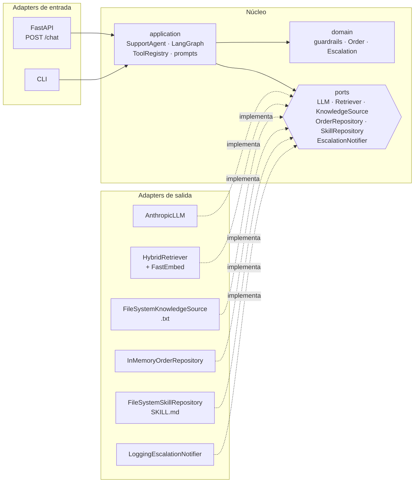

# SUBMISSION — Prueba técnica AI Engineer Senior (TiendaHogar)

## Arquitectura propuesta y justificación

> Diagramas editables en [docs/arquitectura.drawio](docs/arquitectura.drawio) (se abre en draw.io / diagrams.net): 1) arquitectura hexagonal, 2) flujo del agente en LangGraph, 3) mapeo a producción.

```mermaid
flowchart LR
    U[Cliente<br/>web / curl / CLI] -->|POST /chat| API[FastAPI<br/>auth X-API-Key opcional]
    API --> G

    subgraph G[Grafo LangGraph · estado por session_id]
        IG{{Guardrail de entrada<br/>reglas deterministas}}
        R[Retrieve<br/>híbrido denso + léxico<br/>top-k=4 · umbral 0.25 / 0.12]
        A[Agente<br/>Claude + system prompt]
        T[Tools]
        OG{{Guardrail de salida}}
        E[Escalamiento<br/>respuesta plantilla]
        N[Sin contexto<br/>respuesta plantilla]

        IG -->|reembolso >$500 · queja trato<br/>disputa facturación · legal| E
        IG -->|ok| R
        R -->|0 docs y sin intención de pedido| N
        R -->|docs como contexto| A
        A -->|tool_use| T
        T --> A
        A -->|end_turn| OG
    end

    T --> P[(consultar_estado_pedido<br/>tabla mock)]
    T --> H[escalar_a_humano<br/>soporte@tiendahogar.example]
    R --> KB[(5 documentos<br/>índice en memoria)]
```

**Arquitectura hexagonal (ports & adapters)**

El flujo anterior vive en el núcleo de aplicación. Todo lo externo (LLM, base de conocimiento, índice vectorial, pedidos, skills, notificaciones, HTTP) entra o sale por **ports**, interfaces declaradas como `typing.Protocol`, y se implementa con **adapters** que se conectan en un único *composition root* (`bootstrap.py`).



| Capa | Contenido | Puede depender de |
|---|---|---|
| `domain/` | `Document`, `Order`, `Escalation`, `Conversation`, guardrails deterministas (reglas de Doc 4 y Doc 5) | nada (Python puro) |
| `ports/` | `LLMPort` (+ errores `LLMError`), `RetrieverPort`, `KnowledgeSourcePort`, `OrderRepositoryPort`, `SkillRepositoryPort`, `EscalationNotifierPort`, `ConversationRepositoryPort` | `domain` |
| `application/` | `SupportAgent` (grafo LangGraph), `ChatService` (turno + historial), `OrderStatusService` (`consultar_estado_pedido(order_id: str) -> dict`), `ToolRegistry`, prompts | `domain`, `ports` |
| `adapters/inbound/` | FastAPI (`/chat`, `/conversations`, `/health`, chat web con historial, OpenAPI, API key opcional), CLI | `application`, `ports` |
| `adapters/outbound/` | Claude (SDK `anthropic`), retriever híbrido + fastembed, `.txt`, `SKILL.md`, pedidos mock, notificador, historial en JSON | `domain`, `ports` |
| `bootstrap.py` | Conecta cada port con su adapter a partir de `config.py` | todo |

`tests/test_architecture.py` analiza los imports del código fuente y falla si una capa interna depende de una externa. Por ejemplo: el dominio importando FastAPI, la aplicación importando un adapter, o la API HTTP importando el SDK de Anthropic.

**Componentes clave**

- **Guardrails en tres capas:** (1) reglas regex de dominio antes del LLM; (2) la tool `escalar_a_humano` + system prompt para paráfrasis que las reglas no ven; (3) un control de salida que bloquea cualquier respuesta que "apruebe" un reembolso y garantiza que toda escalación incluya el canal humano. Cada escalamiento se publica por `EscalationNotifierPort`; si la notificación falla, la respuesta al cliente no se interrumpe.
- **Skill de conversación** (`skills/atencion_al_cliente/SKILL.md`): tono, empatía, saludos y formato, editables por negocio o CX sin tocar código. Se anexa al system prompt **después** de las reglas de seguridad, que viven en `application/prompts.py` y prevalecen ante cualquier conflicto.
- **Historial de conversaciones** (`ChatService` + `ConversationRepositoryPort`): cada turno se guarda con su metadata en un JSON por conversación. Si el servidor se reinicia y la conversación continúa, el agente recibe los turnos previos desde el historial. Un fallo al guardar el historial no interrumpe la respuesta.
- **`ToolRegistry`:** agregar una tool nueva (p. ej. inventario vía otro microservicio) es registrar su esquema y su handler en `bootstrap.py`, sin tocar el grafo.

**Por qué este diseño**

- **Lo crítico no depende del LLM.** Los casos que el negocio prohíbe resolver (Doc 4 y Doc 5) se detectan con reglas deterministas antes de llamar al modelo. Son auditables, testeables, sin costo de tokens y sin latencia. El LLM es la segunda red para lo que las reglas no capturan, y el guardrail de salida es la tercera.
- **Anti-alucinación por construcción.** (a) Si ningún documento supera el umbral y la pregunta no trata de un pedido, se responde con una plantilla sin invocar al LLM. (b) Si hay contexto, el system prompt restringe las fuentes de verdad a `<contexto>` y a los resultados de las tools. (c) La tool nunca fabrica datos de un pedido inexistente.
- **Hexagonal para crecer sin reescribir.** El prototipo usa archivos y tablas en memoria, pero el núcleo solo conoce interfaces. Pasar a Databricks, al OMS real o a Kafka significa escribir adapters, no tocar la lógica del agente ni sus tests. Además, cada port se puede sustituir por un doble de prueba: los tests corren sin red ni API key.
- **LangGraph y no una cadena lineal.** El flujo tiene ramas (escalar, sin contexto, bucle de tools) que conviene que sean explícitas, visibles y testeables por nodo. Además trae checkpointer para multi-turno y se mapea directo a un despliegue productivo.
- **SDK de Anthropic dentro de los nodos, sin capa de abstracción LangChain.** Da control total del request: tools con `strict: true`, `effort`, `fallbacks` server-side y bloques de thinking. El historial es append-only, un requisito de los modelos Claude actuales para conservar el razonamiento entre turnos, y además mantiene válido el prompt cache.
- **Modelo:** `claude-opus-5-5` con `effort: low`, configurable por variable de entorno. Para un chat de soporte con respuestas cortas, un esfuerzo bajo da buena calidad con menos latencia y costo. Se activa `fallbacks: "default"` para que un rechazo del clasificador de seguridad se reintente en otro modelo en lugar de dejar al cliente sin respuesta.

**Trade-offs por el límite de tiempo**

- Índice y memoria de conversación en proceso (`InMemorySaver`): se pierden al reiniciar y no escalan horizontalmente. Es suficiente para el prototipo.
- Guardrail de entrada basado en regex: es preciso y explicable, pero de recall limitado ante paráfrasis. Por eso existe la capa 2.
- No hay streaming ni evaluación automática con LLM-as-judge. La suite de pruebas valida la orquestación con adapters falsos del LLM.
- La hexagonal agrega más archivos y una capa de indirección que no hace falta para 5 documentos. Se aceptó a cambio de poder conectar nuevos sistemas sin tocar el núcleo, que es el objetivo declarado del proyecto.

## Decisiones técnicas de RAG

- **Chunking:** no se aplicó. Cada documento es un único párrafo de 30 a 60 palabras con un solo tema, así que partirlo solo fragmentaría el contexto (p. ej., separar "Reembolsos mayores a $500…" de su política) sin mejorar la precisión. Se indexa `título + contenido` como una unidad: 1 documento = 1 chunk.
  *Con miles de documentos:* chunking por estructura (secciones y encabezados) con un tamaño objetivo de unos 300 a 500 tokens y un solapamiento de 10 a 15%. Cada chunk llevaría metadatos (doc_id, sección, vigencia, país, tipo de producto) para filtrar antes de la búsqueda. Además: búsqueda híbrida (BM25 + vectores) en un vector store gestionado, un reranker (cross-encoder) sobre los top-20/50, y re-indexación incremental cuando cambia un documento.
- **Embeddings:** `sentence-transformers/paraphrase-multilingual-MiniLM-L12-v2` vía `fastembed` (ONNX). Motivos: es **multilingüe** (el corpus y las preguntas están en español), corre **local en CPU** sin API key ni costo (los tests corren offline una vez cacheado), pesa unos 220 MB y genera 384 dimensiones, así que es rápido. Se descartó `multilingual-e5-large` porque pesa unos 2.2 GB y su ganancia de calidad no se justifica para 5 documentos.
  En la calibración, MiniLM puntuaba bajo las consultas cortas ("¿Garantía de una licuadora?" → 0.24), así que el score final es **híbrido**: `0.7 · coseno + 0.3 · léxico`. El componente léxico es la coincidencia de términos del dominio ponderada por IDF, con stemming por prefijo. Así, el top-1 fue correcto en 18 de 18 preguntas de prueba.
- **Threshold de recuperación:** umbral de **dos niveles** sobre el score híbrido, calibrado empíricamente. (1) **Umbral de dominio, 0.25:** decide si la pregunta tiene relación con las políticas. Las preguntas válidas quedaron en ≥ 0.28 y las claramente fuera de dominio ("receta de pastel", "¿venden televisores?", "hola") en ≤ 0.18. (2) **Umbral de contexto, 0.12:** si la pregunta es del dominio, se incluyen hasta **4 documentos** con score ≥ 0.12. Así entran políticas relacionadas que puntúan bajo por sí solas, como Devoluciones (0.15) en "quiero un reembolso de $300" o Garantía en "¿puedo devolver algo de hace 40 días?". Con documentos tan cortos, el contexto extra cuesta poco. Este segundo nivel se agregó por un hallazgo de la evaluación end-to-end (ver Pruebas). El umbral es deliberadamente **orientado a recall**: algunos casos limítrofes que comparten vocabulario ("¿cuánto cuesta una refrigeradora?") sí pasan, y ahí la precisión la garantiza el LLM, instruido para responder solo con el contexto y decir "no tengo información" si la respuesta no está.
  **Si ningún documento supera el umbral:** si la pregunta no menciona un pedido (`ORD-…`, "pedido", "orden") y es el primer turno, se responde con una plantilla fija ("no tengo información sobre eso…" + canal de soporte) **sin llamar al LLM**. Si menciona un pedido, o la conversación ya tiene contexto previo, pasa al agente con `<contexto>(sin documentos relevantes)</contexto>`, para que pueda usar la tool o el historial pero no inventar políticas.

## Pruebas automatizadas

Comando exacto (desde la raíz del repo, con dependencias instaladas):

```bash
pytest tests/
```

90 tests en unos 5 segundos. No requieren API key: usan el retriever real con embeddings locales y adapters falsos para el LLM y el notificador.

| Archivo | Qué cubre |
|---|---|
| `test_knowledge_base.py` | Los 5 documentos se cargan desde `data/knowledge_base/` completos, en orden y con el texto **sin alterar**. Un archivo mal formado se rechaza. |
| `test_retrieval.py` | El top-1 es el documento correcto para preguntas claras de cada política (incluida una de **garantía** que verifica "6 meses") y para consultas cortas. Se respetan top-k y los dos umbrales; las políticas relacionadas entran al contexto (Devoluciones en una pregunta de reembolso). Las preguntas fuera de dominio no recuperan nada. |
| `test_orders.py` | La tool mantiene la **firma exacta** `(order_id: str) -> dict`. `ORD-1001` devuelve exactamente su fila; un pedido entregado no tiene fecha; los IDs escritos en formato libre (`ord 1003`, `ORD1003`) se normalizan. IDs **inválidos** (`ORD-9999`, vacío, inyección) → `encontrado=False`, `estado="no encontrado"` y **ningún** dato fabricado. El servicio funciona con cualquier adapter del repositorio. |
| `test_guardrails.py` | Se **activa el escalamiento** para reembolsos > $500 (incluye "$1,250.00" y "2 mil"), quejas de trato, disputas de facturación y temas legales. No se activa para preguntas normales, reembolsos ≤ $500 ni IDs de pedido confundidos con montos. El guardrail de salida bloquea "tu reembolso ha sido aprobado". |
| `test_agent_graph.py` | Recorrido end-to-end del grafo: el escalamiento ocurre **sin llamar al LLM**; la tool alimenta al LLM con los datos reales; un pedido inexistente llega como "no encontrado"; las preguntas fuera de dominio no llegan al LLM; el contexto RAG se envía en el prompt; la tool `escalar_a_humano` fuerza el canal humano; el historial es append-only entre turnos; los escalamientos se publican por el port de notificación, y un fallo del notificador no rompe la respuesta. |
| `test_conversation_skill.py` | La skill se carga sin frontmatter y se inyecta después de las reglas de seguridad. Los saludos y agradecimientos llegan al LLM, y un mensaje fuera de dominio que empieza con "hola" no se trata como saludo. |
| `test_logging.py` | El RAG, las tools y los escalamientos quedan registrados con el `session_id` del turno. |
| `test_architecture.py` | Reglas de dependencia de la hexagonal, verificadas sobre los imports del código: el dominio no depende de nada, los ports solo del dominio, la aplicación no conoce adapters ni frameworks, y los adapters de entrada no dependen de los de salida. |
| `test_conversations.py` | Historial: título y turnos (dominio); guardado, lectura, orden y borrado en JSON, sin salir de la carpeta ante IDs maliciosos (adapter); cada turno queda registrado con su metadata, la conversación **continúa tras un reinicio** y un fallo del historial no rompe la respuesta (caso de uso); endpoints `/conversations` y validación del `session_id` (HTTP). |
| `test_api.py` | Contrato HTTP de `/health` y `/chat`, y exigencia de `X-API-Key` cuando se configura. |

### Pruebas de integración end-to-end con LLM-as-judge

```bash
pytest -m integration   # requiere ANTHROPIC_API_KEY; consume tokens
```

Sin una plataforma de evaluación externa (LangSmith u otra), el evaluador es **otro modelo de Claude** (`claude-sonnet-5-5`, distinto del agente `claude-opus-5-5`, para evitar la auto-preferencia), invocado con salidas estructuradas (`messages.parse` + Pydantic), así que el veredicto siempre es JSON válido.

- **22 casos end-to-end** por HTTP real, en las categorías RAG, tool, guardrails, no inventar, prompt injection, empatía y multi-turno. Cada caso tiene **verificaciones deterministas** (escalamiento, tools, fuentes) y una **rúbrica atómica** que el juez califica criterio por criterio. La fidelidad (no inventar nada que no esté en los documentos o en la tabla de pedidos) se evalúa siempre, y el juez recibe esa información como verdad de referencia.
- **Calibración del juez (8 casos):** debe reprobar respuestas malas conocidas, incluida una que intenta manipularlo con instrucciones dentro del texto, y aprobar una correcta.
- **Reporte:** `reports/llm_eval_report.md` con el veredicto y la justificación de cada criterio.

**Qué encontró la evaluación y cómo se corrigió** (estos casos son los que los unit tests no podían ver):

1. **Detalles de procesos inventados** (primera corrida: 13/19). El agente decía cosas como "el ID está en tu correo de confirmación", "un agente te acompaña en el proceso" o "adjunta una foto del comprobante". Se corrigió con una regla en el system prompt. Además, el juez se ajustó para no penalizar la sugerencia de escribir a soporte, que es una instrucción explícita del agente.
2. **Recall del RAG en preguntas que cruzan políticas.** Con "quiero un reembolso de $300", la Política de devoluciones puntuaba 0.15, debajo del umbral, y el agente respondía que no conocía los requisitos. Se corrigió con el **umbral de contexto de dos niveles** y se agregaron casos que cruzan políticas (devolución con defecto fuera de los 30 días, reembolso de exactamente $500).
3. **Clasificar el caso por su cuenta.** Ante "se me cayó la lavadora", el agente afirmaba que la garantía "no cubre accidentes", una categoría que la política no menciona. Se agregó una regla: citar la política con sus propias palabras y dejar la evaluación del caso concreto al equipo de soporte. Tras el cambio, el caso pasó en 3 de 3 corridas.

**Resultado final: 22/22 casos end-to-end y 8/8 de calibración.**

## Cómo mapearías esto a producción

Gracias a la arquitectura hexagonal, la mayor parte de la migración consiste en **escribir adapters nuevos para los ports existentes** y cambiar su conexión en `bootstrap.py`. El dominio, el grafo del agente, los guardrails y sus tests no cambian.

| Prototipo | Stack Grupo Mariposa |
|---|---|
| Agente LangGraph en FastAPI | Agente desplegado en **Microsoft Foundry**: el grafo se empaqueta como agente hospedado (contenedor) o se reexpresa con Foundry Agent Service. Claude se consume desde Foundry (cliente `AnthropicFoundry` del mismo SDK, sin cambios en la lógica). Como los `fallbacks` server-side no existen en Foundry, se usaría el middleware de fallback del SDK. Identidad gestionada (Entra ID) en lugar de API keys. |
| 5 documentos en memoria + fastembed | **Databricks**: los documentos fuente como tablas Delta en **Unity Catalog** (gobierno, linaje y permisos por grupo). Un pipeline de ingesta hace el chunking y los embeddings y alimenta un índice de **Mosaic AI Vector Search** con *Delta Sync* (re-indexación automática), usando búsqueda híbrida y filtros por metadatos. El retriever del agente pasa a ser un cliente de ese índice o una tool expuesta vía Unity Catalog functions. El umbral se re-calibra con un set de evaluación en MLflow. |
| `consultar_estado_pedido` con tabla mock | Llamada al OMS real expuesta y protegida en **Apigee**: OAuth2 o mTLS, cuotas, rate limiting, caching corto y versionado. El agente solo conoce el proxy de Apigee, y el propio `/chat` del agente se publica también detrás de Apigee para los canales (web, app, WhatsApp). |
| Escalamiento como respuesta con email | Además de responder, el nodo de escalamiento publica un evento `support.escalation.created` en **Kafka** (categoría, motivo, `session_id` y transcript con PII enmascarada). Lo consume el sistema de ticketing o CRM, que asigna un agente humano o supervisor (p. ej., aprobación de reembolsos > $500). Otros eventos: `support.conversation.completed` para analítica y evaluación offline, y `kb.document.updated` para disparar la re-indexación. |
| `InMemorySaver` + historial en `conversations/*.json` | Checkpointer persistente y un adapter de `ConversationRepositoryPort` sobre Cosmos DB o PostgreSQL, para conversaciones multi-instancia, retención y auditoría. |
| Logs locales | Trazas OpenTelemetry/MLflow por nodo (retrieval, scores, tools, guardrails), dashboards de tasa de escalamiento y "sin respuesta", y evaluación continua (groundedness y precisión de escalamiento) en Databricks. |
| Guardrails regex | Se mantienen como primera capa determinista y se complementan con Azure AI Content Safety / Prompt Shields para prompt injection y contenido dañino, más un clasificador de intención entrenado con datos reales. |

## Limitaciones conocidas

- **Guardrail por reglas:** no detecta paráfrasis sin palabras clave ("el total no cuadra con lo que pagué"), montos escritos en letras ("ochocientos dólares") ni otros idiomas. Lo mitiga la tool `escalar_a_humano` del LLM, pero esa capa es probabilística. Puede haber falsos positivos (p. ej., "demanda" en otro sentido).
- **Reembolsos > $500 sin monto explícito:** si el cliente pide el reembolso de una refrigeradora sin decir el precio, el agente no conoce el valor (no hay catálogo de precios) y depende del LLM. Supuesto: "remitir al canal humano" para reembolsos > $500 = soporte@tiendahogar.example (Doc 4 pide un supervisor humano pero no define un canal distinto).
- **Umbrales calibrados con pocas preguntas** (unas 40, escritas por mí). El umbral de contexto (0.12) privilegia el recall: si el corpus creciera, habría que revisarlo junto con un reranker. Con tráfico real se debe recalibrar con un set etiquetado. Las preguntas limítrofes que comparten vocabulario pasan al LLM y dependen de su obediencia al system prompt.
- **Evaluación con juez LLM sin calibración humana:** el juez se valida con respuestas malas conocidas, pero no contra un set etiquetado por humanos. Además, el juez y el agente no son deterministas: un caso puede variar entre corridas, y conviene repetir la suite antes de sacar conclusiones de un solo resultado.
- **Estado en memoria:** conversaciones e índice se pierden al reiniciar, no se comparten entre réplicas y no tienen TTL ni límite de longitud de historial.
- **Historial compartido y en archivos:** cualquier persona con acceso al chat ve todas las conversaciones (no hay usuarios). Además, los JSON en disco no escalan a varias réplicas ni tienen política de retención. En producción, cada conversación pertenecería al cliente autenticado y viviría en una base de datos.
- **Sin autenticación de usuario final:** cualquiera con la API key de demo puede consultar cualquier `order_id`. En producción, la tool debe validar que el pedido pertenece al cliente autenticado.
- **Fechas:** la garantía y la ventana de 30 días dependen de la fecha de compra, que el sistema no conoce. El agente solo puede explicar la política.

## Tiempo invertido

Aproximadamente **12 horas**, repartidas en 3 días (unas 4 horas diarias).

| Actividad | Tiempo aprox. |
|---|---|
| Agente base: RAG híbrido y calibración del umbral, tool de pedidos, guardrails, grafo LangGraph y API FastAPI | 3 h |
| Pruebas: unit tests y pruebas end-to-end con juez LLM (incluida la corrección de los hallazgos) | 2.5 h |
| Arquitectura hexagonal (refactor) y documentación: README, SUBMISSION y diagramas | 2.5 h |
| Experiencia de conversación: skill de tono y empatía, frontend del chat e historial de conversaciones | 2 h |
| Contenedor Docker y despliegue de la demo en AWS (Lightsail + API Gateway) | 2 h |
